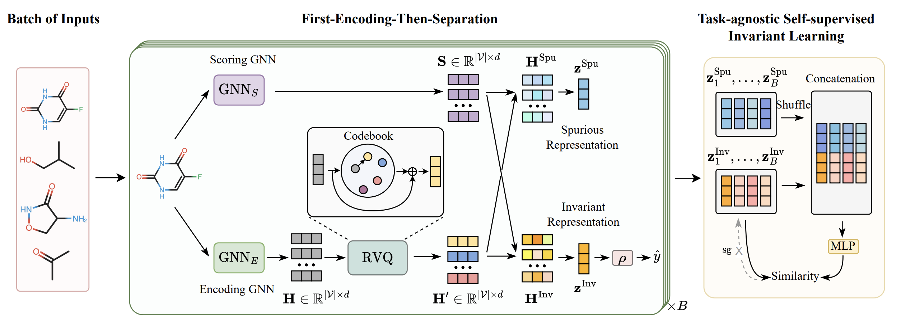

# Learning Invariant Molecular Representation in Latent Discrete Space
This repository is the official implementation of our paper:

**Learning Invariant Molecular Representation in Latent Discrete Space**

_Xiang Zhuang, Qiang Zhang*, Keyan Ding, Yatao Bian, Xiao Wang, Jingsong Lv, Hongyang Chen, Huajun Chen* (* denotes correspondence)_

Advances in Neural Information Processing Systems (NeurIPS) 2023

<div align=center>
</div>

## Environment
To run the code successfully, the following dependencies need to be installed:
```
Python                     3.8      
torch                      1.10.1
torch_geometric            2.0.4
torch_scatter              2.0.9
torch_cluster              1.6.0
torch_sparse               0.6.13
torch_spline_conv          1.2.1
rdkit_pypi                 2022.9.5
vector_quantize_pytorch    1.0.7
ogb                        1.3.6
```

This repo is also depended on `GOOD` and `DrugOOD`, please follow the installation methods provided for each package:
- GOOD (Version 1.1.1)
  - Repository: https://github.com/divelab/GOOD/
  - Installation: Please follow the instructions provided in the repository to install.
- DrugOOD (Version 0.0.1)
  - Repository: https://github.com/tencent-ailab/DrugOOD
  - Installation: Please follow the instructions provided in the repository to install.

## Data
The data used in the experiments can be downloaded from the following sources:

1. GOOD
   - [GOODPCBA](https://drive.google.com/file/d/1WGieOjtgNXtGoO6o1EGhKrZj0zWU7AJl/view?usp=sharing)
   - [GOODHIV](https://drive.google.com/file/d/1CoOqYCuLObnG5M0D8a2P2NyL61WjbCzo/view?usp=sharing)
   - [GOODZINC](https://drive.google.com/file/d/1CHR0I1JcNoBqrqFicAZVKU3213hbsEPZ/view?usp=sharing)
   - Extract the downloaded files and save the contents in the `data` directory.
2. DrugOOD
    - download from [link](https://drive.google.com/drive/folders/19EAVkhJg0AgMx7X-bXGOhD4ENLfxJMWC).
    - Extract the downloaded file and save the contents in the `drugood-data-chembl30` directory.

An example of the folder hierarchy after adding the data files:
```
├── data
│   ├── GOODHIV
│   ├── GOODPCBA
│   ├── GOODZINC
├── drugood-data-chembl30
│   ├── lbap_core_ec50_assay.json
│   └── ...
├── models
│   ├── model.py
│   └── ...
├── run.py
└── README.md
```
## Running Script
#### Training
```
python run.py --dataset GOODZINC --domain scaffold --shift concept --num_e 4000 --bs 256 --gamma 0.5 --inv_w 0.01 --reg_w 0.5 --gpu 0 --exp_name ZINC --exp_id scaffold-concept
```
Running parameters and descriptions are as follows:
| Parameter | Description | Choices |
| --- | --- | --- |
| dataset | name of dataset | `GOODHIV`, `GOODZINC`, `GOODPCBA`, `ic50_assay`, `ic50_scaffold`, `ic50_size`, `ec50_assay`, `ec50_scaffold`, `ec50_size`.|
| domain | environment-splitting strategy | `scaffold`, `size`. Only need to be specified for datasets in `GOOD`. |
| shift | type of distribution shift | `covariate`, `concept`. Only need to be specified for datasets in `GOOD`. |
| num_e | code book size | - |
| bs | batch size | - |
| gamma | threshold $\gamma$ | - |
| inv_w | $\lambda_1$ | - |
| reg_w | $\lambda_2$ | - |
| gpu | which GPU to use | - |
| exp_name | experiment name | - |
| exp_id | experiment ID | - |

#### Evaluation
We provide the hyperparameters for the training of each dataset in the Appendix, and provide the corresponding checkpoints in the [release page](https://github.com/HICAI-ZJU/iMoLD/releases).
```
python eval.py --dataset GOODZINC --domain scaffold --shift concept --load_path checkpoint/GOODZINC-scaffold-concept.pkl
```
The `load_path` parameter specifies the path to load the checkpoint.

## Citation
If you use or extend our work, please cite the paper as follows:

```bibtex
@InProceedings{zhuang2023learning,
  title={Learning Invariant Molecular Representation in Latent Discrete Space},
  author={Xiang Zhuang and Qiang Zhang and Keyan Ding and Yatao Bian and Xiao Wang and Jingsong Lv and Hongyang Chen and Huajun Chen},
  booktile={Advances in Neural Information Processing Systems},
  year={2023}
}
```